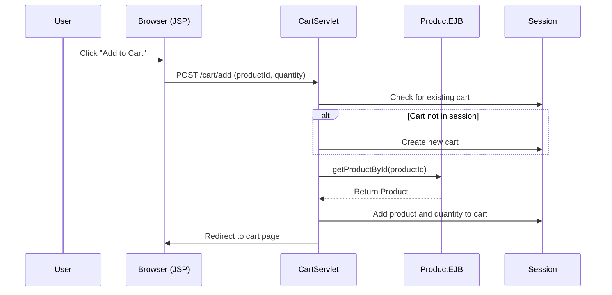
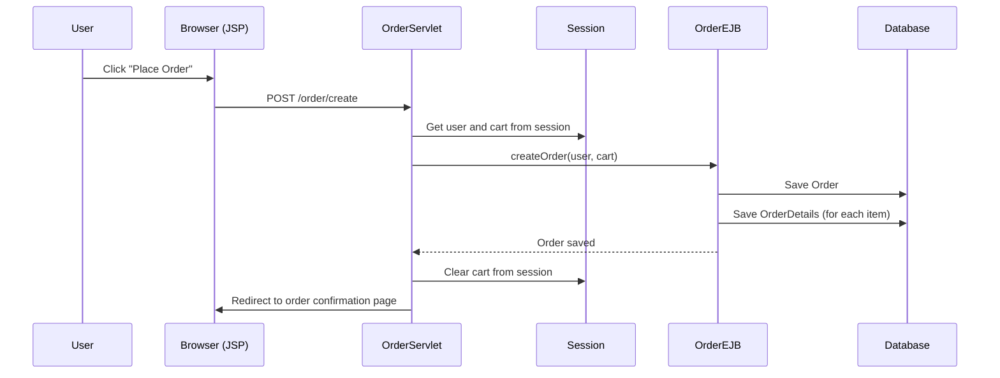

# Sequence diagrams

**Sequence diagram for adding product into cart:**

```mermaid
sequenceDiagram
    participant U as User
    participant B as Browser (JSP)
    participant S as CartServlet
    participant P as ProductEJB
    participant Ses as Session

    U->>B: Click "Add to Cart"
    B->>S: POST /cart/add (productId, quantity)
    S->>Ses: Check for existing cart
    alt Cart not in session
        S->>Ses: Create new cart
    end
    S->>P: getProductById(productId)
    P-->>S: Return Product
    S->>Ses: Add product and quantity to cart
    S->>B: Redirect to cart page
```

---

**Sequence diagram for placing an order:**

```mermaid
sequenceDiagram
    participant U as User
    participant B as Browser (JSP)
    participant OS as OrderServlet
    participant Ses as Session
    participant OE as OrderEJB
    participant DB as Database

    U->>B: Click "Place Order"
    B->>OS: POST /order/create
    OS->>Ses: Get user and cart from session
    OS->>OE: createOrder(user, cart)
    OE->>DB: Save Order
    OE->>DB: Save OrderDetails (for each item)
    OE-->>OS: Order saved
    OS->>Ses: Clear cart from session
    OS->>B: Redirect to order confirmation page
```